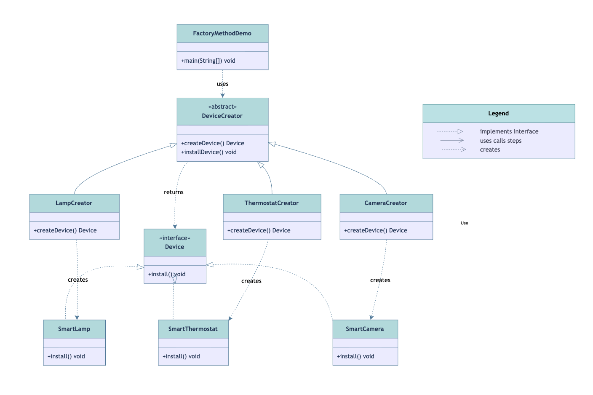
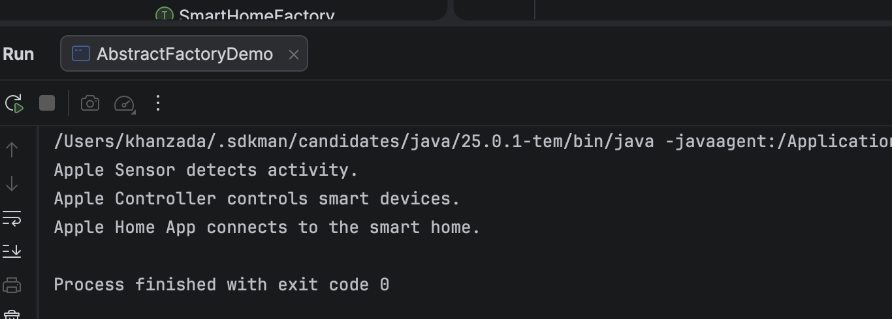
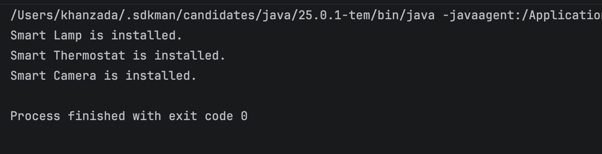

# Smart Home Hub

**Group:** SE-2539
**Name:** Khanzada Nyshanbek Adilqyzy

# Introduction

This project is created to demonstrate two creational design patterns from Lecture 2: Factory Method and Abstract Factory.
The project is based on a Smart Home Hub system. The system can create different smart home devices and also create groups of related smart home components.
The main goal of using these patterns is to separate object creation from the client code. This makes the code more flexible, easier to maintain and easier to extend.

# Factory Method

Factory Method is a creational design pattern. It defines a method for creating objects in a superclass and allows subclasses to decide which object should be created.
The main idea is to delegate object creation to a separate factory method. The creator works with the product through an interface, so it does not need to know the exact concrete product.
In this project, Factory Method is used to create individual smart home devices. The Product interface is Device. It contains the install() method.

There are three Concrete Products: SmartLamp, SmartThermostat and SmartCamera.
SmartLamp installs a smart lamp. SmartThermostat installs a smart thermostat. SmartCamera installs a smart camera.
DeviceCreator is the abstract Creator. It contains the createDevice() factory method. It also contains the installDevice() business method.
LampCreator, ThermostatCreator and CameraCreator are Concrete Creators. Each creator overrides createDevice() and creates its own product.

LampCreator creates SmartLamp.

ThermostatCreator creates SmartThermostat.

CameraCreator creates SmartCamera.

The client does not directly create SmartLamp, SmartThermostat or SmartCamera. The concrete creators are responsible for creating these objects. This reduces the dependency between the client and concrete product classes.

# Factory Method UML



# When to use Factory Method

Factory Method can be used when the exact type of object is not known in advance.
It is also useful when an application needs different versions of one product and new product types may be added in the future.
It can simplify the client code when object creation is complex or changes depending on different conditions.
Factory Method also helps separate object creation from the main business logic.

# Advantages of Factory Method

Factory Method separates object creation from client code.
It reduces tight coupling between the creator and concrete products.
New product types can be added by creating new creator and product classes without changing the existing client code.
It also follows the Single Responsibility Principle because the creation logic is separated into creator classes.
It supports the Open/Closed Principle because the system can be extended with new products without changing existing client code.

# Disadvantages of Factory Method
Factory Method can increase the number of classes in the project.
For every new product, a new concrete creator may be needed.
This can make a small project more complicated than necessary.

Factory Method in this project

In our project, Factory Method is suitable because we need to create different types of individual smart home devices.
For example, the client can use DeviceCreator and call installDevice(). The client does not need to know how SmartLamp or SmartCamera is created.

# Abstract Factory

Abstract Factory is also a creational design pattern. It provides an interface for creating families of related objects without specifying their concrete classes.
The main difference from Factory Method is that Abstract Factory creates a group or family of related products.
In this project, Abstract Factory is used to create a family of smart home components.
The abstract products are Sensor, Controller and SmartApp.

Sensor has the detect() method.

Controller has the control() method.

SmartApp has the connect() method.

There are two product families in this project. The first family is the Apple family. It contains AppleSensor, AppleController and AppleApp.
The second family is the Google family. It contains GoogleSensor, GoogleController and GoogleApp.
SmartHomeFactory is the Abstract Factory. It contains three creation methods: createSensor(), createController() and createApp().

AppleHomeFactory and GoogleHomeFactory are Concrete Factories.

AppleHomeFactory creates AppleSensor, AppleController and AppleApp.

GoogleHomeFactory creates GoogleSensor, GoogleController and GoogleApp.

The products created by one factory belong to the same family. This helps keep the products compatible with each other.

# Client

SmartHomeClient is the client of the Abstract Factory. The client receives SmartHomeFactory through its constructor.
This is composition because SmartHomeClient has a SmartHomeFactory.
The client works only with abstract interfaces such as Sensor, Controller, SmartApp and SmartHomeFactory.
The client does not directly create Apple or Google products.

# Family Selection

The product family is selected in AbstractFactoryDemo.
For example, the following line selects the Apple family.


SmartHomeFactory factory = new AppleHomeFactory();


If we want to use the Google family, we can change it to:

SmartHomeFactory factory = new GoogleHomeFactory();


The SmartHomeClient does not need to be changed. This allows the whole product family to be changed at once.

# Abstract Factory UML



# Benefits of Abstract Factory

Abstract Factory separates object creation from the client.
The client does not need to know the concrete product classes.
Changing the factory allows the application to change the whole product family.
It helps keep related products compatible. It is useful when a system needs several families of related products.

# Disadvantages of Abstract Factory

Abstract Factory can make a simple project more complicated.
It introduces more interfaces, factories and product classes.
Adding a new product type can be difficult because the Abstract Factory interface and all concrete factories may need to be changed.
For example, if we add a new product called SmartSpeaker, createSmartSpeaker() would need to be added to SmartHomeFactory, and both AppleHomeFactory and GoogleHomeFactory would need to implement this method.
Therefore, Abstract Factory is more useful when product families are important and need to be changed or switched.

# Factory Method and Abstract Factory Comparison

Factory Method mainly focuses on creating one product.
Abstract Factory focuses on creating a family of related products.
Factory Method usually uses inheritance.
In our project, LampCreator, ThermostatCreator and CameraCreator extend DeviceCreator.
Abstract Factory usually uses composition.
In our project, SmartHomeClient has a SmartHomeFactory.
Factory Method is useful when we need different types of one product.
Abstract Factory is useful when we need several related products that should work together.
In our project, Factory Method creates individual smart home devices, while Abstract Factory creates complete Apple or Google smart home product families.

# Why We Used Both Patterns

We used Factory Method because the application needs to create different individual smart home devices.
We used Abstract Factory because the application also needs to create related groups of smart home components.
Factory Method answers the question: Which device should be created?
Abstract Factory answers the question: Which complete family of smart home components should be created?

# Clean Code

The project also follows some ideas from Clean Code Chapter 6.
Data abstraction means hiding implementation details behind interfaces.
In our project, the client works with Device, Sensor, Controller, SmartApp and SmartHomeFactory instead of depending on concrete implementation classes.
This improves encapsulation because the client does not need to know how the concrete objects are created.
The project also follows the idea of the Law of Demeter.
The client communicates with the objects it directly receives and uses their methods instead of accessing internal implementation details.
The project does not use unnecessary getters and setters because the main goal is to hide implementation details and provide meaningful behavior through methods.

# SOLID Principles

Factory Method supports the Single Responsibility Principle because the creation of products is separated into creator classes.
For example, LampCreator is responsible for creating SmartLamp, while DeviceCreator contains the general business logic.
Factory Method also supports the Open/Closed Principle because new product types can be added by creating new product and creator classes without changing the existing client code.
The Dependency Inversion Principle is also supported because the client works with abstract interfaces such as Device and SmartHomeFactory instead of depending directly on concrete product classes.

# Project Structure

```text
assignment2-design-patterns/
│
├── src/
│   └── main/
│       └── java/
│           ├── factorymethod/
│           │   ├── Device.java
│           │   ├── SmartLamp.java
│           │   ├── SmartThermostat.java
│           │   ├── SmartCamera.java
│           │   ├── DeviceCreator.java
│           │   ├── LampCreator.java
│           │   ├── ThermostatCreator.java
│           │   ├── CameraCreator.java
│           │   └── FactoryMethodDemo.java
│           │
│           └── abstractfactory/
│               ├── Sensor.java
│               ├── Controller.java
│               ├── SmartApp.java
│               ├── AppleSensor.java
│               ├── AppleController.java
│               ├── AppleApp.java
│               ├── GoogleSensor.java
│               ├── GoogleController.java
│               ├── GoogleApp.java
│               ├── SmartHomeFactory.java
│               ├── AppleHomeFactory.java
│               ├── GoogleHomeFactory.java
│               ├── SmartHomeClient.java
│               └── AbstractFactoryDemo.java
│
├── images/
│   ├── factory-method-uml.png
│   └── abstract-factory-uml.png
│
├── README.md
└── pom.xml
```

src/main/java/factorymethod contains the Factory Method implementation.

Device.java is the Product interface.

SmartLamp.java, SmartThermostat.java and SmartCamera.java are Concrete Products.

DeviceCreator.java is the Abstract Creator.

LampCreator.java, ThermostatCreator.java and CameraCreator.java are Concrete Creators.

FactoryMethodDemo.java is used to run the Factory Method example.

src/main/java/abstractfactory contains the Abstract Factory implementation.

Sensor.java, Controller.java and SmartApp.java are Abstract Products.

AppleSensor.java, AppleController.java and AppleApp.java are Apple Concrete Products.

GoogleSensor.java, GoogleController.java and GoogleApp.java are Google Concrete Products.

SmartHomeFactory.java is the Abstract Factory.

AppleHomeFactory.java and GoogleHomeFactory.java are Concrete Factories.

SmartHomeClient.java is the Client.

AbstractFactoryDemo.java is used to run the Abstract Factory example.

# Running the Project

The project can be run using IntelliJ IDEA or Maven.

FactoryMethodDemo can be run to test the Factory Method.

The output is:



AbstractFactoryDemo can be run to test the Abstract Factory.

When the Apple family is selected, the output is:


# Conclusion

Factory Method and Abstract Factory are both creational design patterns, but they solve different problems.
Factory Method is used to create individual products through different creators.
Abstract Factory is used to create families of related products.
In our Smart Home Hub project, Factory Method creates individual smart home devices, while Abstract Factory creates complete Apple or Google product families.
Both patterns reduce direct dependencies on concrete classes and make the system easier to extend and maintain.

# GitHub

**Repository:** Add your GitHub repository link here

**Author:** Khanzada Nyshanbek Adilqyzy

**Group:** SE-2539
